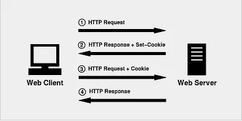

# Cookie、Session、Token那点事儿
## 什么是Cookie？
Cookie 技术产生源于 HTTP 协议在互联网上的急速发展。随着互联网时代的策马奔腾，带宽等限制不存在了，人们需要更复杂的互联网社交活动，**就必须同服务器保持活动状态**。于是，在浏览器发展初期，为了适应用户的需求，技术上推出了各种保持 Web 浏览状态的手段，其中就包括了 Cookie 技术。Cookie 在计算机中是个储存在浏览器目录中的文件，当浏览器运行时，储存在 RAM 中发挥作用（此种 Cookies 称作 Session Cookies），一旦用户从该网站或服务器退出，Cookie 可储存在用户本地的硬盘上（此种 Cookies 称作 Persistent Cookies）。  
### Cookie 起源
1993年，网景公司雇员 Lou Montulli 为了让用户在访问某网站时，进一步提高访问速度，同时也为了进一步实现个人化网络，发明了今天广泛使用的 Cookie。  
### Cookie 时效性
目前有些 Cookie 是临时的，有些则是持续的。临时的 Cookie 只在浏览器上保存一段规定的时间，一旦超过规定的时间，该 Cookie 就会被系统清除。  
### Cookie 使用限制
Cookie 必须在 HTML 文件的内容输出之前设置；不同的浏览器对 Cookie 的处理规则不一致，使用时一定要考虑；客户端如果设置禁止 Cookie，则 Cookie 不能建立。并且在客户端，一个浏览器能创建的 Cookie 数量最多为300个，并且每个不能超过4KB，每个 Web 站点能设置的 Cookie 总数不能超过 20 个。
### 执行流程
1. 首先，客户端会发送一个 HTTP 请求到服务器端。
2. 服务器端接受客户端请求后，发送一个 HTTP 响应到客户端，这个响应头，其中就包含 Set-Cookie 头部。
3. 在客户端发起的第二次请求（注意：如果服务器需要我们带上 Cookie，我们就需要在上个步骤拿到这个 Cookie 然后作为请求头一起发起第二次请求），提供给了服务器端可以用来唯一标识客户端身份的信息。这时，服务器端也就可以判断客户端是否启用了 cookies。尽管，用户可能在和应用程序交互的过程中突然禁止 cookies 的使用，但是，这个情况基本是不太可能发生的，所以可以不加以考虑，这在实践中也被证明是对的。  
  
